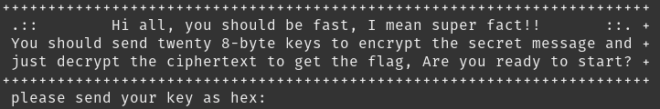
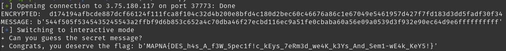

# Be Fast Writeup

by xhyr

Rapid mastery of breaking symmetric encryption, deciphering codes with precision, and navigating complexities with unprecedented speed and efficiency are requirements for every professional cryptographer. So, be fast.

`nc 3.75.180.117 37773`

## Initial Thoughts

The challenge provides us the server [script](src/be_fast.py).

Connecting to the server with netcat, we get this prompt:



It asks us for twenty 8-byte keys to encrypt the message then we just have to decrypt the ciphertext to get the flag. Pretty straightforward.

## Pwntools

For this challenge, I will use pwntools to automate sending keys.

```
url = "3.75.180.117"
port = "37773"

io = remote(url, port)
keys = [
    b'aaaaaaaa',
    b'bbbbbbbb',
    b'cccccccc',
    b'dddddddd',
    b'eeeeeeee',
    b'ffffffff',
    b'gggggggg',
    b'hhhhhhhh',
    b'iiiiiiii',
    b'jjjjjjjj',
    b'kkkkkkkk',
    b'llllllll',
    b'mmmmmmmm',
    b'nnnnnnnn',
]

for key in keys:
    io.recvuntil(b'hex: ')
    io.sendline(hexlify(key))

io.interactive()
```

After this, we get asked for the decrypted secret message.

```
enc = b'8b08c3890cd8a107c60fbef4ba36764e2f2e...'
Can you guess the secret message?
```

Now, we just have to supply the decrypted message.

## Decrypting

Diving into the server script, we find this part of the code that encrypts the message:

```python
if len(KEYS) == STEP:
    HKEY = KEYS[:7]
    shuffle(HKEY)
    NKEY = KEYS[-7:]
    shuffle(NKEY)
    for h in HKEY: NKEY = [key, shift(key, 1)] + NKEY
    enc = encrypt(secret_msg, NKEY[0])
    for key in NKEY[1:]:
      enc = encrypt(enc, key)
    pr(border, f'enc = {hexlify(enc)}')
    pr(border, f'Can you guess the secret message? ')
    alarm(md + 1)
    msg = sc().strip()
    alarm(0)
    if msg == hexlify(secret_msg):
      die(border, f'Congrats, you deserve the flag: {flag}')
    else:
      die(border, f'Sorry, your input is incorrect! Bye!!')
```

In here, I realized that the server really only needs 14 keys, not 20 and that only the last 7 keys are used for encrypting the text.

So, what it does here is just shuffles the last 7 keys, adds 7 pairs of copies of the last key, one of them shifted once (`shift(key, 1)`).

However, since our keys are just repeating characters (`b'nnnnnnnn'`) shifting doesn't affect the key at all.

So, in the end the order of encryption keys becomes 14 copies of `b'nnnnnnnn' and the shuffled last 7 keys.

```python
NKEY = [b'nnnnnnnn'] * 14 + shuffle(NKEY[-7:])
```

Since it's like this, we just have to brute force decrypt with all the possible permutations of the shuffled last 7 keys.

Then, while brute forcing we just need to check if we found the valid order of keys by checking if the ciphertext now starts with `b'TOP_SECRET:'`.

So, here is the full script:

```python
#!/usr/bin/python3

from pwn import *
from binascii import *
from itertools import permutations
from Crypto.Cipher import DES

def pad(text):
    if len(text) % 8 != 0:
        text += (b'\xff' * (8 - len(text) % 8))
    return text

def decrypt(msg, key):
    des = DES.new(key, DES.MODE_ECB)
    decrypted_data = des.decrypt(msg)
    return pad(decrypted_data)

context.log_level = 'debug'

url = "3.75.180.117"
port = "37773"

io = remote(url, port)
# io = process(['python3', 'src/be_fast.py'])

keys = [
    b'aaaaaaaa',
    b'bbbbbbbb',
    b'cccccccc',
    b'dddddddd',
    b'eeeeeeee',
    b'ffffffff',
    b'gggggggg',
    b'hhhhhhhh',
    b'iiiiiiii',
    b'jjjjjjjj',
    b'kkkkkkkk',
    b'llllllll',
    b'mmmmmmmm',
    b'nnnnnnnn',
]

for key in keys:
    io.recvuntil(b'hex: ')
    io.sendline(hexlify(key))

io.recvuntil(b'enc =')
encrypted = io.recvline().decode().strip()[2:-1]

print('ENCRYPTED: ', encrypted)

# last 7 keys
keys = [
        b'hhhhhhhh',
        b'iiiiiiii',
        b'jjjjjjjj',
        b'kkkkkkkk',
        b'llllllll',
        b'mmmmmmmm',
        b'nnnnnnnn',
    ]

perms = permutations(keys)

enc_data = unhexlify(encrypted)

for perm in perms:

    msg = enc_data
    for k in perm:
        msg = decrypt(msg, k)

    perma_key = b'nnnnnnnn'
    for i in range(14):
        msg = decrypt(msg, perma_key)

    if (msg.startswith(b'TOP_SECRET:')):
        print('MESSAGE:', hexlify(msg))
        io.sendline(hexlify(msg).rstrip(b'f'))
        break

io.interactive()
```



Then we get the flag: MAPNA{DES_h4s_A_f3W_5pec1f!c_kEys_7eRm3d_we4K_k3Ys_And_Sem1-wE4k_KeY5!}
