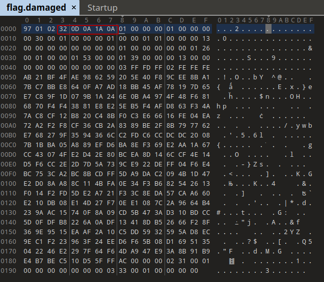

# JigBoy

> Description : Jigboy, the superhero, possesses the remarkable ability to reel in colossal fish from the depths of the deep blue sea.

JigBoy is one of the forensics challenge from the MAPNA CTF 2024 which ended up getting 5 solves in the CTF and i upsolved it since I couldnt play the CTF on time. 

After extracting the file , At the first glance we see a file with ``.damaged`` extension. We can assume its some kind of "Fix the damaged file" challenge so we open it in an hex editor.

I could'nt figure out what type of damaged file this was so i decided to google the first few hex of the file `32 0D 0A 1A 0A` to see if we can get information from the header.
Straight up on the 2nd link it tells that this header belongs to a `.jbg` file , more precisely `.jbg2` and the correct header is `97 4A 42 32 0D 0A 1A 0A`

To understand the Header more - \
1. `0x97` : The first character is nonprintable, so that the file cannot
be mistaken for ASCII.
2. `0x4A 0x42 0x32` : decodes to jb2 
3. `0x1` : This field indicates that the file uses the sequential organisation, and that the number of pages is known.
4. `0x00 0x00 0x00 0x01` : This indicates that the file only has 1 page

After fixing the header , I opened the file in STDU viewer but It still gave me an error.. :O

So there's more than initial file header corrupted so I started reading more about the jb2 format and looking at the changed hex. To understand and to get familiar with the data , I downloaded a sample jbig file and compared the hex

Sample from the Internet \
 

 Now I am assuming the size bytes of the file (`00 30 00 01 00 00 00 01 00 00 01 01 00 00 00 13`)
  has been modified too so I just copied the bytes from the sample to the original file along with the end hex data `0x00 0x03 0x33 0x00 ` to `0x00 0x03 0x31 0x00` and tried opening the file and *VOILA* :D We get the flag 

 

I tried tweaking the size bytes to see what exactly was meant to be changed since I used the same bytes as the sample Image but i ended up either crashing the file or It showing nothing.

> To read more about the JBIG file format : (https://ics.uci.edu/~dan/class/267/papers/jbig2.pdf)

